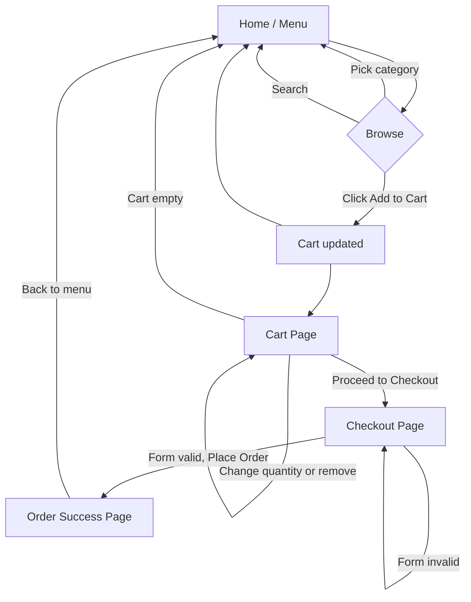

# React + TypeScript + Vite

# 🍕 Foodie – Food Ordering App

A food ordering web app built while learning **React** and **TypeScript**, step by step.

Users can browse a menu, filter and search food, manage a cart, and place an order.

---

## Table of Contents

1. [Tech Stack](#tech-stack)
2. [Features](#features)
3. [App Flow](#app-flow)
4. [Pages and Routes](#pages-and-routes)
5. [Wireframes](#wireframes)
6. [Data Models](#data-models)
7. [Folder Structure](#folder-structure)
8. [Learning Roadmap](#learning-roadmap)
9. [Getting Started](#getting-started)

---

## Tech Stack

| Tool                        | Purpose                        |
| --------------------------- | ------------------------------ |
| Vite                        | Fast dev server and build tool |
| React                       | UI library                     |
| TypeScript                  | Type safety                    |
| React Compiler              | Automatic render optimization  |
| React Router                | Page navigation (Phase 8)      |
| Tailwind CSS or CSS Modules | Styling (Phase 10)             |

---

## Features

### MVP (must have)

- [ ] Menu list with food cards (image, name, price, category)
- [ ] Filter by category (Pizza, Burger, Drinks, Desserts)
- [ ] Search by food name
- [ ] Add to cart, remove from cart
- [ ] Increase / decrease quantity
- [ ] Cart total calculation
- [ ] Checkout form (name, phone, address) with validation
- [ ] Order confirmation screen

### Nice to have

- [ ] Cart persists after refresh (localStorage)
- [ ] Veg / Non-veg filter
- [ ] Sort by price or rating
- [ ] Loading and error states when fetching menu
- [ ] Dark mode
- [ ] Responsive layout for mobile

### Future ideas

- [ ] Favourites list
- [ ] Order history
- [ ] Real backend and authentication

---

## App Flow



**In words:**

1. User lands on the **Menu** page and sees all food items.
2. They filter by category or search by name.
3. They click **Add to Cart**. The cart badge in the header updates.
4. They open the **Cart** page to adjust quantities or remove items.
5. They go to **Checkout**, fill in delivery details, and place the order.
6. The **Success** page confirms the order. The cart is cleared.

---

## Pages and Routes

| Route       | Page          | Purpose                             |
| ----------- | ------------- | ----------------------------------- |
| `/`         | Menu          | Browse, search, filter, add to cart |
| `/cart`     | Cart          | Review items, change quantity       |
| `/checkout` | Checkout      | Delivery details form               |
| `/success`  | Order Success | Confirmation message                |
| `*`         | Not Found     | 404 fallback                        |

---

## Wireframes

### 1. Menu Page (`/`)

```
┌──────────────────────────────────────────────┐
│ 🍕 Foodie                         🛒 Cart (2)│  ← Header
├──────────────────────────────────────────────┤
│ [ 🔍 Search food...                        ] │  ← SearchBar
│                                              │
│ [All] [Pizza] [Burger] [Drinks] [Desserts]   │  ← CategoryFilter
├──────────────────────────────────────────────┤
│ ┌────────────┐ ┌────────────┐ ┌────────────┐ │
│ │   [img]    │ │   [img]    │ │   [img]    │ │
│ │ Margherita │ │ Veg Burger │ │ Cold Coffee│ │  ← FoodCard
│ │ ₹199       │ │ ₹149       │ │ ₹99        │ │
│ │ [Add + ]   │ │ [Add + ]   │ │ [Add + ]   │ │
│ └────────────┘ └────────────┘ └────────────┘ │
│ ┌────────────┐ ┌────────────┐ ┌────────────┐ │
│ │    ...     │ │    ...     │ │    ...     │ │
│ └────────────┘ └────────────┘ └────────────┘ │
├──────────────────────────────────────────────┤
│              © 2026 Foodie                   │  ← Footer
└──────────────────────────────────────────────┘
```

### 2. Cart Page (`/cart`)

```
┌──────────────────────────────────────────────┐
│ 🍕 Foodie                         🛒 Cart (2)│
├──────────────────────────────────────────────┤
│ Your Cart                                    │
│                                              │
│ [img] Margherita      [-] 2 [+]   ₹398  [🗑] │  ← CartItem
│ [img] Cold Coffee     [-] 1 [+]   ₹99   [🗑] │
│ ─────────────────────────────────────────    │
│                         Subtotal:   ₹497     │  ← CartSummary
│                         Delivery:   ₹40      │
│                         Total:      ₹537     │
│                                              │
│ [← Continue Shopping]   [Proceed to Checkout]│
└──────────────────────────────────────────────┘
```

Empty state:

```
│            Your cart is empty 😢             │
│            [Browse Menu]                     │
```

### 3. Checkout Page (`/checkout`)

```
┌──────────────────────────────────────────────┐
│ Checkout                                     │
│                                              │
│ Full Name   [__________________________]     │
│ Phone       [__________________________]     │
│ Address     [__________________________]     │
│             [__________________________]     │
│ Payment     (•) Cash on Delivery             │
│             ( ) UPI                          │
│                                              │
│ Order Summary: 3 items            ₹537       │
│                                              │
│ [← Back to Cart]          [Place Order]      │
└──────────────────────────────────────────────┘
```

Validation messages show under each field, for example: _"Phone must be 10 digits"_.

### 4. Success Page (`/success`)

```
┌──────────────────────────────────────────────┐
│                     ✅                       │
│            Order placed successfully!        │
│            Order ID: #FD1042                 │
│            Estimated delivery: 30 mins       │
│                                              │
│               [Back to Menu]                 │
└──────────────────────────────────────────────┘
```

---

## Component Tree

```
App
├── Header          (logo + cart badge)
├── Routes
│   ├── MenuPage
│   │   ├── SearchBar
│   │   ├── CategoryFilter
│   │   └── FoodList
│   │       └── FoodCard
│   ├── CartPage
│   │   ├── CartItem
│   │   └── CartSummary
│   ├── CheckoutPage
│   │   └── CheckoutForm
│   ├── SuccessPage
│   └── NotFoundPage
└── Footer
```

---

## Data Models

These TypeScript types are the foundation of the app. We will create them in Phase 2 and extend them later.

```ts
// src/types/index.ts

export type Category = "Pizza" | "Burger" | "Drinks" | "Desserts";

export interface FoodItem {
  id: number;
  name: string;
  description: string;
  price: number;
  category: Category;
  image: string;
  isVeg: boolean;
  rating: number;
}

export interface CartItem {
  food: FoodItem;
  quantity: number;
}

export interface CheckoutFormData {
  fullName: string;
  phone: string;
  address: string;
  paymentMethod: "cod" | "upi";
}

export interface Order {
  id: string;
  items: CartItem[];
  total: number;
  customer: CheckoutFormData;
  placedAt: string;
}
```

---

## Folder Structure

```
src/
├── components/
│   ├── Header.tsx
│   ├── Footer.tsx
│   ├── FoodCard.tsx
│   ├── FoodList.tsx
│   ├── SearchBar.tsx
│   ├── CategoryFilter.tsx
│   ├── CartItem.tsx
│   ├── CartSummary.tsx
│   └── CheckoutForm.tsx
├── pages/
│   ├── MenuPage.tsx
│   ├── CartPage.tsx
│   ├── CheckoutPage.tsx
│   ├── SuccessPage.tsx
│   └── NotFoundPage.tsx
├── context/
│   └── CartContext.tsx
├── data/
│   └── foods.ts
├── types/
│   └── index.ts
├── App.tsx
├── main.tsx
└── index.css
```

---

## Learning Roadmap

| Phase | Topic                                                  | Status |
| ----- | ------------------------------------------------------ | ------ |
| 1     | Project cleanup, first components (`Header`, `Footer`) | ⬜     |
| 2     | TypeScript props, `FoodCard`                           | ⬜     |
| 3     | Typed arrays, `.map()`, `key`, `FoodList`              | ⬜     |
| 4     | `useState`, search, category filter                    | ⬜     |
| 5     | Cart: add, remove, quantity                            | ⬜     |
| 6     | Derived state, checkout form, validation               | ⬜     |
| 7     | Context API + `useReducer`                             | ⬜     |
| 8     | React Router, multiple pages                           | ⬜     |
| 9     | `useEffect`, fetching data, loading/error states       | ⬜     |
| 10    | Styling and polish                                     | ⬜     |
| 11    | Deployment                                             | ⬜     |

Mark each phase ✅ when finished.

---

## Getting Started

```bash
# Install dependencies
npm install

# Start the dev server
npm run dev

# Type-check and build for production
npm run build

# Preview the production build
npm run preview
```

Open `http://localhost:5173` in your browser.

---

## What I'm Learning

- Writing function components with JSX
- Typing props, state, events, and forms in TypeScript
- Managing state with `useState`, `useReducer`, and Context
- Building multi-page apps with React Router
- Fetching data and handling async states
- Structuring a real-world React project

---

## License

For learning purposes.
